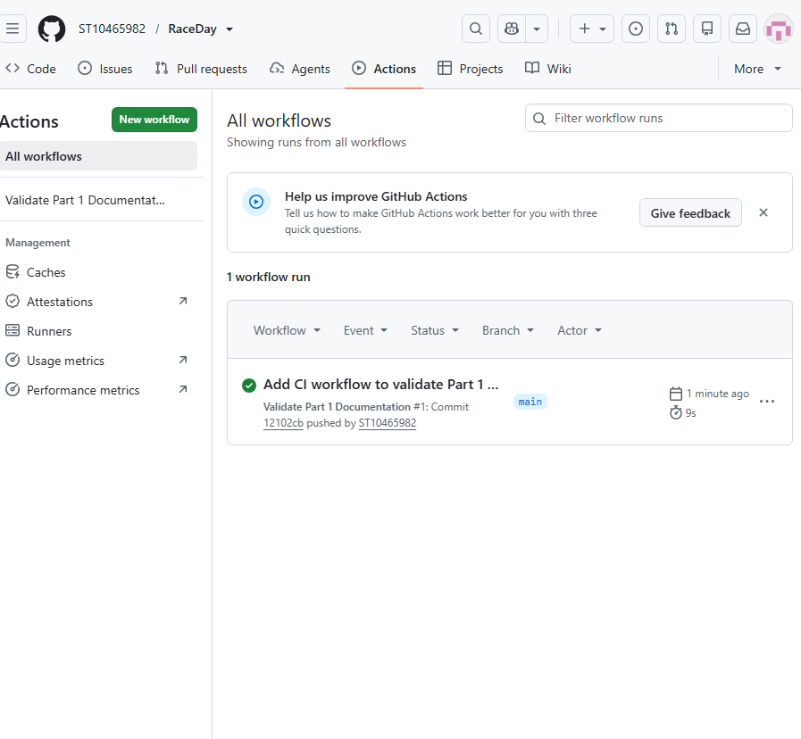

# RaceDay

RaceDay is a full-stack web-based event management system designed for the South African road running, walking and cycling community. The system replaces fragmented paper-based registration and event administration processes with a centralised digital platform.

RaceDay supports event management, participant enrollment and race result management. The project is developed progressively across three parts of the PROG6212 Portfolio of Evidence.

## System Roles

### Organiser

The Organiser is responsible for managing RaceDay events. An Organiser can:

- Create events.
- Edit event information.
- Delete events.
- Manage event categories.
- View participant enrollments.
- Capture participant race results.

### Participant

The Participant uses RaceDay to discover and enter events. A Participant can:

- Create a RaceDay account.
- Manage their personal profile.
- Browse available events.
- Enter an event.
- View their event enrollments.
- Cancel eligible enrollments.
- Track their personal race results.

Role-based access will be enforced at API level in Part 2 and reflected in the MVC application in Part 3.

## Part 1 – System Planning and Database

Part 1 focuses on planning the RaceDay system before application development begins.

The following planning documents are located in the `/docs` folder:

- `ERD.png` – Entity Relationship Diagram for the RaceDay database.
- `RaceDay_API_Endpoint_Plan.md` – RESTful API endpoint specification.
- `RaceDay_Database.sql` – SQL Server database creation and seed-data script.
- `README.md` – Supporting documentation for the planning files.
- `RaceDay_CI_Success.png` – Evidence of the successful GitHub Actions workflow.

## Database Design

The RaceDay database contains six main entities:

- Users
- UserProfiles
- Categories
- Events
- Enrollments
- Results

The Users entity stores both Organisers and Participants while the Role attribute determines the user's system access.

Enrollments connect Participants to Events and prevent a Participant from enrolling in the same event more than once. A completed enrollment may have one recorded Result.

## API Planning

The RaceDay API plan defines endpoints for:

- Authentication
- User profiles
- Events
- Categories
- Event enrollments
- Results

Each endpoint specifies the HTTP method, route, description, required role, request body and expected success and failure responses.

## Database Setup

The database was designed for Microsoft SQL Server.

To create the RaceDay database:

1. Open SQL Server Management Studio (SSMS).
2. Open `docs/RaceDay_Database.sql`.
3. Connect to a SQL Server instance.
4. Execute the complete script.
5. Confirm that the script creates `RaceDayDB` without errors.
6. Verify that the sample records appear in the Users, UserProfiles, Categories, Events, Enrollments and Results tables.

The SQL script includes primary keys, foreign keys, unique constraints, default constraints, check constraints and realistic seed data.

## CI/CD

GitHub Actions is used to validate the Part 1 repository structure and confirm that the required planning documents are available.

## Video Presentation

The Part 1 video presentation demonstrates the RaceDay planning documents, ERD design, API endpoint decisions, GitHub Actions workflow and successful execution of the SQL database script in SQL Server Management Studio.

**YouTube Video:** To be added after the presentation is uploaded.

## Technologies

- GitHub
- GitHub Actions
- SQL Server
- SQL Server Management Studio
- RESTful API planning
- Entity Relationship Modelling

## AI Tool Disclosure

AI tools were used to assist with planning, reviewing and proofreading parts of the project. The final database design, implementation decisions, SQL execution, testing and project explanation were reviewed by the student.
